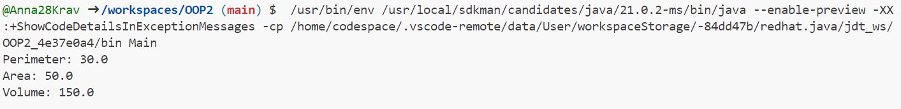
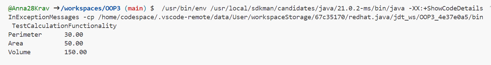
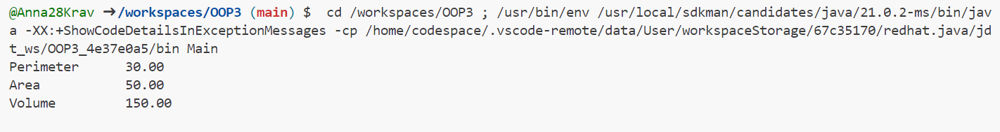
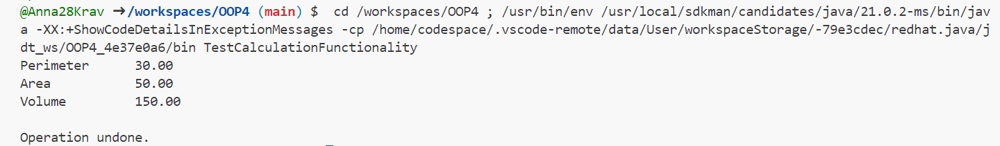

# OOP

**Варіант №7: Визначити периметр, площу та об'єм приміщення за заданими двійковими
значеннями довжини, ширини та висоти.**

# **Завдння 1**

**1.1) Підготувати сховище до розміщення проекту:**


**1.2) Написати просту консольну програму:**

**Код Hello:**
````java
public class Hello {
    public static void main(String[] args) {
        System.out.println("Hello !!!");
    }
}
````
**Фото роботи програми:**


# **Завдання 2**

**2.1) Розробити клас, що серіалізується, для зберігання параметрів і результатів обчислень.
Використовуючи агрегування, розробити клас для знаходження рішення задачі.**

**Код CalculationData:**
````java
import java.io.Serializable;

// Класс, который будет сериализован для хранения параметров и результатов вычислений
class CalculationData implements Serializable {
    private static final long serialVersionUID = 1L;
    private double length;
    private double width;
    private double height;
    private double perimeter;
    private double area;
    private double volume;

    // Конструктор класса
    public CalculationData(double length, double width, double height) {
        this.length = length;
        this.width = width;
        this.height = height;
    }

    // Методы для вычисления периметра, площади и объема
    public void calculatePerimeter() {
        this.perimeter = 2 * (length + width);
    }

    public void calculateArea() {
        this.area = length * width;
    }

    public void calculateVolume() {
        this.volume = length * width * height;
    }

    // Геттеры для получения результатов вычислений
    public double getPerimeter() {
        return perimeter;
    }

    public double getArea() {
        return area;
    }

    public double getVolume() {
        return volume;
    }
}
````

**Код CalculationSolver:**
````java
// Класс для решения задачи по заданным параметрам
class CalculationSolver {
    private CalculationData data;

    // Конструктор класса, принимающий объект CalculationData
    public CalculationSolver(CalculationData data) {
        this.data = data;
    }

    // Метод для выполнения вычислений и возвращения результатов
    public CalculationData solve() {
        data.calculatePerimeter();
        data.calculateArea();
        data.calculateVolume();
        return data;
    }
}
````

**Код Main:**
````java
public class Main {
    public static void main(String[] args) {
        // Создаем объект CalculationData с заданными параметрами
        CalculationData data = new CalculationData(10.0, 5.0, 3.0);

        // Создаем объект CalculationSolver и передаем в него CalculationData
        CalculationSolver solver = new CalculationSolver(data);

        // Выполняем вычисления и получаем результаты
        CalculationData result = solver.solve();

        // Выводим результаты
        System.out.println("Perimeter: " + result.getPerimeter());
        System.out.println("Area: " + result.getArea());
        System.out.println("Volume: " + result.getVolume());
    }
}
````

**Фото роботи програми:**


**2.2) Розробити клас для демонстрації в діалоговому режимі збереження та відновлення стану об'єкта, використовуючи серіалізацію. Показати особливості використання transient полів.**

**Код Room:**
````java
import java.io.*;

class Room implements Serializable {
    private double length;
    private double width;
    private transient double height; // Поле height буде transient

    // Конструктор класу
    public Room(double length, double width, double height) {
        this.length = length;
        this.width = width;
        this.height = height;
    }

    // Метод для розрахунку периметру
    public double calculatePerimeter() {
        return 2 * (length + width);
    }

    // Метод для розрахунку площі
    public double calculateArea() {
        return length * width;
    }

    // Метод для розрахунку об'єму
    public double calculateVolume() {
        return length * width * height;
    }

    // Метод для виведення інформації про кімнату
    public void displayInfo() {
        System.out.println("Perimeter: " + calculatePerimeter());
        System.out.println("Area: " + calculateArea());
        System.out.println("Volume: " + calculateVolume());
    }

    // Методи для збереження та відновлення стану об'єкта
    public void saveState() {
        try (ObjectOutputStream out = new ObjectOutputStream(new FileOutputStream("room.ser"))) {
            out.writeObject(this);
        } catch (IOException e) {
            e.printStackTrace();
        }
    }

    public static Room restoreState() {
        try (ObjectInputStream in = new ObjectInputStream(new FileInputStream("room.ser"))) {
            return (Room) in.readObject();
        } catch (IOException | ClassNotFoundException e) {
            e.printStackTrace();
            return null;
        }
    }
}
````

**Код JMain:**
````java
public class JMain {
    public static void main(String[] args) {
        Room room = new Room(5, 4, 3); // Створюємо новий об'єкт класу Room

        // Збереження стану об'єкта
        room.saveState();

        // Відновлення стану об'єкта
        Room restoredRoom = Room.restoreState();
        if (restoredRoom != null) {
            restoredRoom.displayInfo(); // Виведення інформації про кімнату
        } else {
            System.out.println("Failed to restore room state.");
        }
    }
}
````

**Фото роботи програми:**


**2.3) Розробити клас, що серіалізується, для зберігання параметрів і результатів обчислень.
Використовуючи агрегування, розробити клас для знаходження рішення задачі.**

**Код TestRoomSerialization:**
````java
import java.io.*;

/**
 * Клас для тестування коректності результатів обчислень та серіалізації/десеріалізації.
 */
public class TestRoomSerialization {

    /**
     * Тестирує коректність результатів обчислень та серіалізації/десеріалізації об'єкта Room.
     * @param args аргументи командного рядка
     * @throws IOException при помилці вводу/виводу
     * @throws ClassNotFoundException якщо клас не було знайдено під час десеріалізації
     */
    public static void main(String[] args) throws IOException, ClassNotFoundException {
        // Створюємо новий об'єкт класу Room
        Room room = new Room(5, 4, 3);

        // Збереження стану об'єкта
        room.saveState();

        // Відновлення стану об'єкта
        Room restoredRoom = Room.restoreState();

        // Порівнюємо результати обчислень двох об'єктів
        if (restoredRoom != null) {
            boolean isCorrect = compareRooms(room, restoredRoom);
            if (isCorrect) {
                System.out.println("Тест серіалізації та десеріалізації пройдений успішно!");
            } else {
                System.out.println("Тест серіалізації та десеріалізації не пройдений: результати не співпадають!");
            }
        } else {
            System.out.println("Не вдалося відновити стан кімнати.");
        }
    }

    /**
     * Порівнює результати обчислень двох об'єктів класу Room.
     * @param room1 перший об'єкт класу Room
     * @param room2 другий об'єкт класу Room
     * @return true, якщо результати обчислень співпадають; false - у протилежному випадку
     */
    private static boolean compareRooms(Room room1, Room room2) {
        return room1.calculatePerimeter() == room2.calculatePerimeter() &&
                room1.calculateArea() == room2.calculateArea() &&
                room1.calculateVolume() == room2.calculateVolume();
    }
}
````

**Фото роботи програми:**


# **Завдння 3**

**3.1) Як основа використовувати вихідний текст проекту попередньої лабораторної роботи. Забезпечити розміщення результатів обчислень уколекції з можливістю збереження/відновлення:**

**Код CalculationData:**
````java
import java.io.Serializable;

// Клас, що представляє дані для обчислень
class CalculationData implements Serializable {
    private static final long serialVersionUID = 1L;
    private double length;
    private double width;
    private double height;

    // Конструктор класу
    public CalculationData(double length, double width, double height) {
        this.length = length;
        this.width = width;
        this.height = height;
    }

    // Методи для обчислення периметру, площі та об'єму
    public double calculatePerimeter() {
        return 2 * (length + width);
    }

    public double calculateArea() {
        return length * width;
    }

    public double calculateVolume() {
        return length * width * height;
    }

    // Геттери для отримання параметрів
    public double getLength() {
        return length;
    }

    public double getWidth() {
        return width;
    }

    public double getHeight() {
        return height;
    }

    // Виведення результатів у текстовому вигляді
    public String displayResults(CalculationResultDisplay display) {
        StringBuilder result = new StringBuilder();
        result.append(display.displayPerimeter(calculatePerimeter())).append("\n");
        result.append(display.displayArea(calculateArea())).append("\n");
        result.append(display.displayVolume(calculateVolume())).append("\n");
        return result.toString();
    }
}

// Клас для розрахунку об'єктів кімнати
class Room implements Serializable {
    private static final long serialVersionUID = 1L;
    private double length;
    private double width;
    private transient double height; // Поле height буде transient

    // Конструктор класу
    public Room(double length, double width, double height) {
        this.length = length;
        this.width = width;
        this.height = height;
    }

    // Метод для розрахунку периметру
    public double calculatePerimeter() {
        return 2 * (length + width);
    }

    // Метод для розрахунку площі
    public double calculateArea() {
        return length * width;
    }

    // Метод для розрахунку об'єму
    public double calculateVolume() {
        return length * width * height;
    }

    // Метод для виведення інформації про кімнату
    public String displayInfo(CalculationResultDisplay display) {
        StringBuilder result = new StringBuilder();
        result.append(display.displayPerimeter(calculatePerimeter())).append("\n");
        result.append(display.displayArea(calculateArea())).append("\n");
        result.append(display.displayVolume(calculateVolume())).append("\n");
        return result.toString();
    }
}
````

**3.2) Використовуючи шаблон проектування Factory Method (Virtual Constructor), розробити ієрархію, що передбачає розширення рахунок додавання нових відображуваних класів:**

**Код CalculationDataFactoryImpl:**
````java
// Реалізація фабрики для CalculationData
class CalculationDataFactoryImpl implements CalculationDataFactory {
    @Override
    public CalculationData createCalculationData(double length, double width, double height) {
        return new CalculationData(length, width, height);
    }
}
````

**3.3) Розширити ієрархію інтерфейсом "фабрикованих" об'єктів, що представляє набір методів для відображення результатів обчислень:**

**Код CalculationResultDisplay:**
````java
// Інтерфейс для "фабрикованих" об'єктів, що представляє набір методів для відображення результатів обчислень
interface CalculationResultDisplay {
    String displayPerimeter(double perimeter);
    String displayArea(double area);
    String displayVolume(double volume);
}

// Інтерфейс для "фабрикуючого" методу
interface CalculationDataFactory {
    CalculationData createCalculationData(double length, double width, double height);
}
````

**3.4) Реалізувати ці методи виведення результатів у текстовому виде:**

**Код Main:**
````java
public class Main {
    public static void main(String[] args) {
        // Створюємо об'єкт CalculationData через фабрику
        CalculationDataFactory factory = new CalculationDataFactoryImpl();
        CalculationData data = factory.createCalculationData(10.0, 5.0, 3.0);

        // Виконуємо обчислення та виводимо результати
        CalculationResultDisplay display = new TextCalculationResultDisplay();
        System.out.println(data.displayResults(display));
    }
}
````

**3.5) Розробити тареалізувати інтерфейс для "фабрикуючого" методу:**

**Код TextCalculationResultDisplay:**
````java
// Клас для відображення результатів обчислень у текстовому вигляді
class TextCalculationResultDisplay implements CalculationResultDisplay {
    @Override
    public String displayPerimeter(double perimeter) {
        return "Perimeter: " + perimeter;
    }

    @Override
    public String displayArea(double area) {
        return "Area: " + area;
    }

    @Override
    public String displayVolume(double volume) {
        return "Volume: " + volume;
    }
}
````
**Фото роботи програми:**




# **Завдння 4**

**4.1) За основу використовувати вихідний текст проекту попередньої лабораторної роботи Використовуючи шаблон проектування Factory Method (Virtual Constructor), розширити ієрархію похідними класами, реалізують методи для подання результатів у вигляді текстової таблиці. Параметри відображення таблиці мають визначатися користувачем:**

**Код CalculationData:**
````java
import java.io.Serializable;

// Клас, що представляє дані для обчислень
public class CalculationData implements Serializable {
    private static final long serialVersionUID = 1L;
    private double length;
    private double width;
    private double height;

    // Конструктор класу
    public CalculationData(double length, double width, double height) {
        this.length = length;
        this.width = width;
        this.height = height;
    }

    // Методи для обчислення периметру, площі та об'єму
    public double calculatePerimeter() {
        return 2 * (length + width);
    }

    public double calculateArea() {
        return length * width;
    }

    public double calculateVolume() {
        return length * width * height;
    }

    // Геттери для отримання параметрів
    public double getLength() {
        return length;
    }

    public double getWidth() {
        return width;
    }

    public double getHeight() {
        return height;
    }

    // Виведення результатів у текстовому вигляді
    public String displayResults(CalculationResultDisplay display) {
        return display.displayResults(this);
    }
}
````

**Код CalculationDataFactory:**
````java
// Фабрика для CalculationData
public interface CalculationDataFactory {
    CalculationData createCalculationData(double length, double width, double height);
}
````


**4.2) Продемонструвати заміщення (перевизначення, overriding), поєднання (перевантаження, overloading), динамічне призначення методів (Пізнє зв'язування, поліморфізм, dynamic method dispatch).:**

**Код CalculationDataFactoryImpl:**
````java
// Реалізація фабрики для CalculationData
public class CalculationDataFactoryImpl implements CalculationDataFactory {
    @Override
    public CalculationData createCalculationData(double length, double width, double height) {
        return new CalculationData(length, width, height);
    }
}
````

**Код TextCalculationResultDisplay:**
````java
// Клас для відображення результатів обчислень у вигляді текстової таблиці з заданими параметрами
public class TextTableCalculationResultDisplay implements CalculationResultDisplay {
    private String tableFormat;

    // Конструктор класу
    public TextTableCalculationResultDisplay(String tableFormat) {
        this.tableFormat = tableFormat;
    }

    // Метод для відображення результатів у вигляді текстової таблиці
    @Override
    public String displayResults(CalculationData data) {
        StringBuilder result = new StringBuilder();
        result.append(String.format(tableFormat, "Perimeter", data.calculatePerimeter())).append("\n");
        result.append(String.format(tableFormat, "Area", data.calculateArea())).append("\n");
        result.append(String.format(tableFormat, "Volume", data.calculateVolume())).append("\n");
        return result.toString();
    }
}
````


**4.3) Забезпечити діалоговий інтерфейс із користувачем:**

**Код CalculationResultDisplay:**
````java
// Інтерфейс для "фабрикованих" об'єктів, що представляє набір методів для відображення результатів обчислень
public interface CalculationResultDisplay {
    String displayResults(CalculationData data);
}
````


**4.4) Розробити клас для тестування основної функціональності:**

**Код TestCalculationFunctionality:**
````java
public class TestCalculationFunctionality {

    // Метод для тестування обчислень та виведення результатів
    public static void testCalculationAndDisplay() {
        // Створюємо об'єкт CalculationData через фабрику
        CalculationDataFactory factory = new CalculationDataFactoryImpl();
        CalculationData data = factory.createCalculationData(10.0, 5.0, 3.0);

        // Виконуємо обчислення та виводимо результати
        CalculationResultDisplay display = new TextTableCalculationResultDisplay("%-15s%-10.2f");
        System.out.println(data.displayResults(display));
    }

    // Додайте інші методи для тестування різних аспектів функціональності

    public static void main(String[] args) {
        // Викликаємо методи для тестування різних аспектів програми
        testCalculationAndDisplay();
    }
}
````

**Фото роботи програми:**




**4.5) Використати коментарі для автоматичної генерації документації засобами javadoc:**

**Код Main:**
````java
// Основний клас програми
public class Main {
    public static void main(String[] args) {
        // Діалоговий інтерфейс з користувачем
        // Приклад створення об'єкта CalculationData через фабрику та відображення результатів у вигляді текстової таблиці
        CalculationDataFactory factory = new CalculationDataFactoryImpl();
        CalculationData data = factory.createCalculationData(10.0, 5.0, 3.0);

        // Відображення результатів у вигляді текстової таблиці з заданими параметрами
        String tableFormat = "%-15s%-10.2f"; // Формат таблиці
        CalculationResultDisplay display = new TextTableCalculationResultDisplay(tableFormat);
        System.out.println(data.displayResults(display));
    }
}
````

**Фото роботи програми:**




# **Завдння 5**

**5.1) Реалізувати можливість скасування (undo) операцій (команд):**

**Код CalculationData:**
````java
import java.io.Serializable;

// Клас, що представляє дані для обчислень
public class CalculationData implements Serializable {
    private static final long serialVersionUID = 1L;
    private double length;
    private double width;
    private double height;

    // Конструктор класу
    public CalculationData(double length, double width, double height) {
        this.length = length;
        this.width = width;
        this.height = height;
    }

    // Методи для обчислення периметру, площі та об'єму
    public double calculatePerimeter() {
        return 2 * (length + width);
    }

    public double calculateArea() {
        return length * width;
    }

    public double calculateVolume() {
        return length * width * height;
    }

    // Геттери для отримання параметрів
    public double getLength() {
        return length;
    }

    public double getWidth() {
        return width;
    }

    public double getHeight() {
        return height;
    }
}
````

**Код CreateCalculationDataCommand:**
````java
// Команда для створення CalculationData
public class CreateCalculationDataCommand implements Command {
    private CalculationDataFactory factory;
    private double length;
    private double width;
    private double height;
    private CalculationData data;

    public CreateCalculationDataCommand(CalculationDataFactory factory, double length, double width, double height) {
        this.factory = factory;
        this.length = length;
        this.width = width;
        this.height = height;
    }

    @Override
    public void execute() {
        data = factory.createCalculationData(length, width, height);
    }

    @Override
    public void undo() {
        // Відміна створення об'єкта
        data = null;
    }

    public CalculationData getData() {
        return data;
    }
}
````

**Код Command:**
````java
// Інтерфейс для команд
interface Command {
    void execute();
    void undo();
}
````


**5.2) Продемонструвати поняття "макрокоманда":**

**Код MacroCommand:**
````java
import java.util.Stack;

// Макрокоманда для виконання групи команд
public class MacroCommand implements Command {
    private Stack<Command> commands = new Stack<>();

    // Метод для виконання всіх команд в макрокоманді
    @Override
    public void execute() {
        for (Command command : commands) {
            command.execute();
        }
    }

    // Метод для скасування всіх команд в макрокоманді
    @Override
    public void undo() {
        for (Command command : commands) {
            command.undo();
        }
    }

    // Метод для додавання команди до макрокоманди
    public void addCommand(Command command) {
        commands.push(command);
    }
}
````


**5.3) При розробці програми використовувати шаблон Singletone:**

**Код CalculationDataFactory:**
````java
// Фабрика для CalculationData
public class CalculationDataFactory {
    private static CalculationDataFactory instance;

    private CalculationDataFactory() {}

    public static CalculationDataFactory getInstance() {
        if (instance == null) {
            instance = new CalculationDataFactory();
        }
        return instance;
    }

    public CalculationData createCalculationData(double length, double width, double height) {
        return new CalculationData(length, width, height);
    }
}
````


**5.4) Забезпечити діалоговий інтерфейс із користувачем:**

**Код TextTableCalculationResultDisplay:**
````java
// Клас для відображення результатів обчислень у вигляді текстової таблиці з заданими параметрами
public class TextTableCalculationResultDisplay {
    private String tableFormat;

    // Конструктор класу
    public TextTableCalculationResultDisplay(String tableFormat) {
        this.tableFormat = tableFormat;
    }

    // Метод для відображення результатів у вигляді текстової таблиці
    public String displayResults(CalculationData data) {
        StringBuilder result = new StringBuilder();
        result.append(String.format(tableFormat, "Perimeter", data.calculatePerimeter())).append("\n");
        result.append(String.format(tableFormat, "Area", data.calculateArea())).append("\n");
        result.append(String.format(tableFormat, "Volume", data.calculateVolume())).append("\n");
        return result.toString();
    }
}
````


**5.5) Розробити клас для тестування функціональності програми:**

**Код TestCalculationFunctionality:**
````java
// Клас для тестування функціональності програми
public class TestCalculationFunctionality {
    public static void main(String[] args) {
        // Ініціалізуємо фабрику та команди
        CalculationDataFactory factory = CalculationDataFactory.getInstance();
        CreateCalculationDataCommand createCommand = new CreateCalculationDataCommand(factory, 10.0, 5.0, 3.0);
        MacroCommand macroCommand = new MacroCommand();
        macroCommand.addCommand(createCommand);

        // Викликаємо методи для тестування
        macroCommand.execute(); // Виконуємо створення CalculationData
        CalculationData data = createCommand.getData(); // Отримуємо створені дані

        // Відображення результатів у вигляді текстової таблиці з заданими параметрами
        String tableFormat = "%-15s%-10.2f"; // Формат таблиці
        TextTableCalculationResultDisplay display = new TextTableCalculationResultDisplay(tableFormat);
        System.out.println(display.displayResults(data));

        // Скасування операцій
        macroCommand.undo();
        System.out.println("Operation undone.");
    }
}
````

**Фото роботи програми:**

