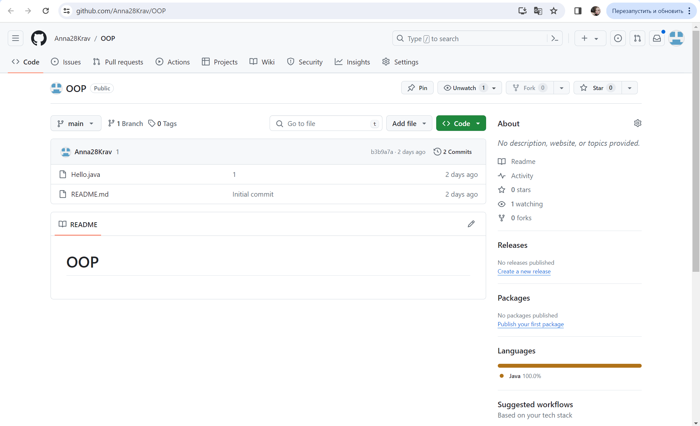
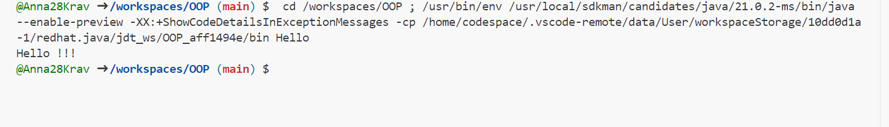
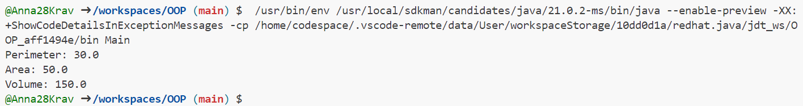
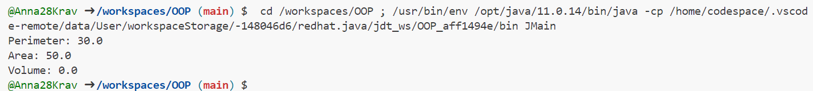
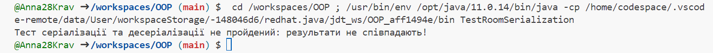

# OOP

# **Завдння 1**

**1.1) Підготувати сховище до розміщення проекту:**


**1.2) Написати просту консольну програму:**

**Код Hello:**
````java
public class Hello {
    public static void main(String[] args) {
        System.out.println("Hello !!!");
    }
}
````
**Фото роботи програми:**



# **Завдання 2**

**2.1) Розробити клас, що серіалізується, для зберігання параметрів і результатів обчислень.
Використовуючи агрегування, розробити клас для знаходження рішення задачі.**

**Код CalculationData:**
````java
import java.io.Serializable;

// Класс, который будет сериализован для хранения параметров и результатов вычислений
class CalculationData implements Serializable {
    private static final long serialVersionUID = 1L;
    private double length;
    private double width;
    private double height;
    private double perimeter;
    private double area;
    private double volume;

    // Конструктор класса
    public CalculationData(double length, double width, double height) {
        this.length = length;
        this.width = width;
        this.height = height;
    }

    // Методы для вычисления периметра, площади и объема
    public void calculatePerimeter() {
        this.perimeter = 2 * (length + width);
    }

    public void calculateArea() {
        this.area = length * width;
    }

    public void calculateVolume() {
        this.volume = length * width * height;
    }

    // Геттеры для получения результатов вычислений
    public double getPerimeter() {
        return perimeter;
    }

    public double getArea() {
        return area;
    }

    public double getVolume() {
        return volume;
    }
}
````

**Код CalculationSolver:**
````java
// Класс для решения задачи по заданным параметрам
class CalculationSolver {
    private CalculationData data;

    // Конструктор класса, принимающий объект CalculationData
    public CalculationSolver(CalculationData data) {
        this.data = data;
    }

    // Метод для выполнения вычислений и возвращения результатов
    public CalculationData solve() {
        data.calculatePerimeter();
        data.calculateArea();
        data.calculateVolume();
        return data;
    }
}
````

**Код Main:**
````java
public class Main {
    public static void main(String[] args) {
        // Создаем объект CalculationData с заданными параметрами
        CalculationData data = new CalculationData(10.0, 5.0, 3.0);

        // Создаем объект CalculationSolver и передаем в него CalculationData
        CalculationSolver solver = new CalculationSolver(data);

        // Выполняем вычисления и получаем результаты
        CalculationData result = solver.solve();

        // Выводим результаты
        System.out.println("Perimeter: " + result.getPerimeter());
        System.out.println("Area: " + result.getArea());
        System.out.println("Volume: " + result.getVolume());
    }
}
````

**Фото роботи програми:**




**2.2) Розробити клас для демонстрації в діалоговому режимі збереження та відновлення стану об'єкта, використовуючи серіалізацію. Показати особливості використання transient полів.**

**Код Room:**
````java
import java.io.*;

class Room implements Serializable {
    private double length;
    private double width;
    private transient double height; // Поле height буде transient

    // Конструктор класу
    public Room(double length, double width, double height) {
        this.length = length;
        this.width = width;
        this.height = height;
    }

    // Метод для розрахунку периметру
    public double calculatePerimeter() {
        return 2 * (length + width);
    }

    // Метод для розрахунку площі
    public double calculateArea() {
        return length * width;
    }

    // Метод для розрахунку об'єму
    public double calculateVolume() {
        return length * width * height;
    }

    // Метод для виведення інформації про кімнату
    public void displayInfo() {
        System.out.println("Perimeter: " + calculatePerimeter());
        System.out.println("Area: " + calculateArea());
        System.out.println("Volume: " + calculateVolume());
    }

    // Методи для збереження та відновлення стану об'єкта
    public void saveState() {
        try (ObjectOutputStream out = new ObjectOutputStream(new FileOutputStream("room.ser"))) {
            out.writeObject(this);
        } catch (IOException e) {
            e.printStackTrace();
        }
    }

    public static Room restoreState() {
        try (ObjectInputStream in = new ObjectInputStream(new FileInputStream("room.ser"))) {
            return (Room) in.readObject();
        } catch (IOException | ClassNotFoundException e) {
            e.printStackTrace();
            return null;
        }
    }
}
````

**Код JMain:**
````java
public class JMain {
    public static void main(String[] args) {
        Room room = new Room(5, 4, 3); // Створюємо новий об'єкт класу Room

        // Збереження стану об'єкта
        room.saveState();

        // Відновлення стану об'єкта
        Room restoredRoom = Room.restoreState();
        if (restoredRoom != null) {
            restoredRoom.displayInfo(); // Виведення інформації про кімнату
        } else {
            System.out.println("Failed to restore room state.");
        }
    }
}
````

**Фото роботи програми:**




**2.3) Розробити клас, що серіалізується, для зберігання параметрів і результатів обчислень.
Використовуючи агрегування, розробити клас для знаходження рішення задачі.**

**Код TestRoomSerialization:**
````java
import java.io.*;

/**
 * Клас для тестування коректності результатів обчислень та серіалізації/десеріалізації.
 */
public class TestRoomSerialization {

    /**
     * Тестирує коректність результатів обчислень та серіалізації/десеріалізації об'єкта Room.
     * @param args аргументи командного рядка
     * @throws IOException при помилці вводу/виводу
     * @throws ClassNotFoundException якщо клас не було знайдено під час десеріалізації
     */
    public static void main(String[] args) throws IOException, ClassNotFoundException {
        // Створюємо новий об'єкт класу Room
        Room room = new Room(5, 4, 3);

        // Збереження стану об'єкта
        room.saveState();

        // Відновлення стану об'єкта
        Room restoredRoom = Room.restoreState();

        // Порівнюємо результати обчислень двох об'єктів
        if (restoredRoom != null) {
            boolean isCorrect = compareRooms(room, restoredRoom);
            if (isCorrect) {
                System.out.println("Тест серіалізації та десеріалізації пройдений успішно!");
            } else {
                System.out.println("Тест серіалізації та десеріалізації не пройдений: результати не співпадають!");
            }
        } else {
            System.out.println("Не вдалося відновити стан кімнати.");
        }
    }

    /**
     * Порівнює результати обчислень двох об'єктів класу Room.
     * @param room1 перший об'єкт класу Room
     * @param room2 другий об'єкт класу Room
     * @return true, якщо результати обчислень співпадають; false - у протилежному випадку
     */
    private static boolean compareRooms(Room room1, Room room2) {
        return room1.calculatePerimeter() == room2.calculatePerimeter() &&
                room1.calculateArea() == room2.calculateArea() &&
                room1.calculateVolume() == room2.calculateVolume();
    }
}
````

**Фото роботи програми:**

